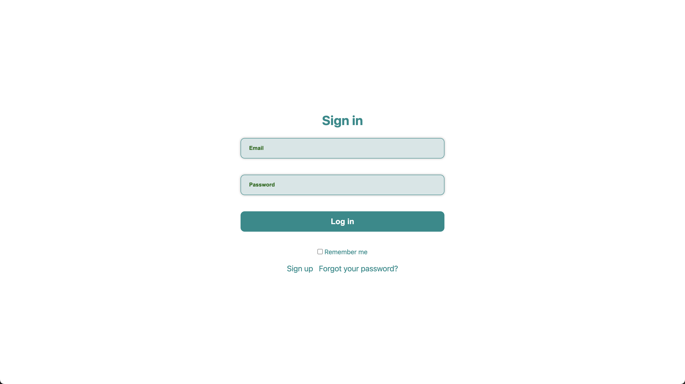
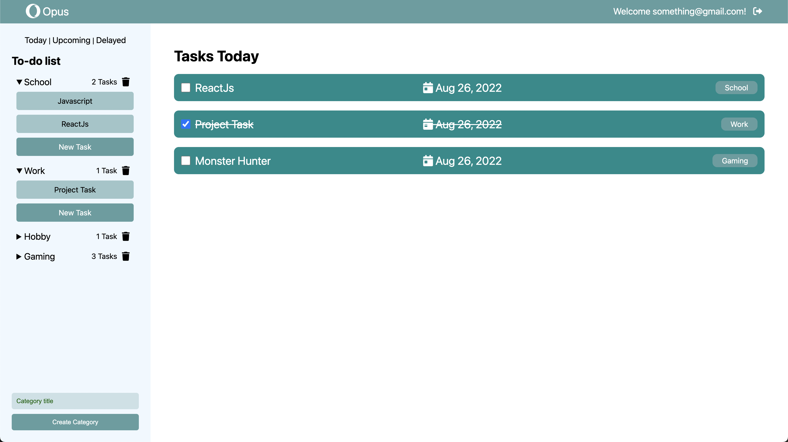
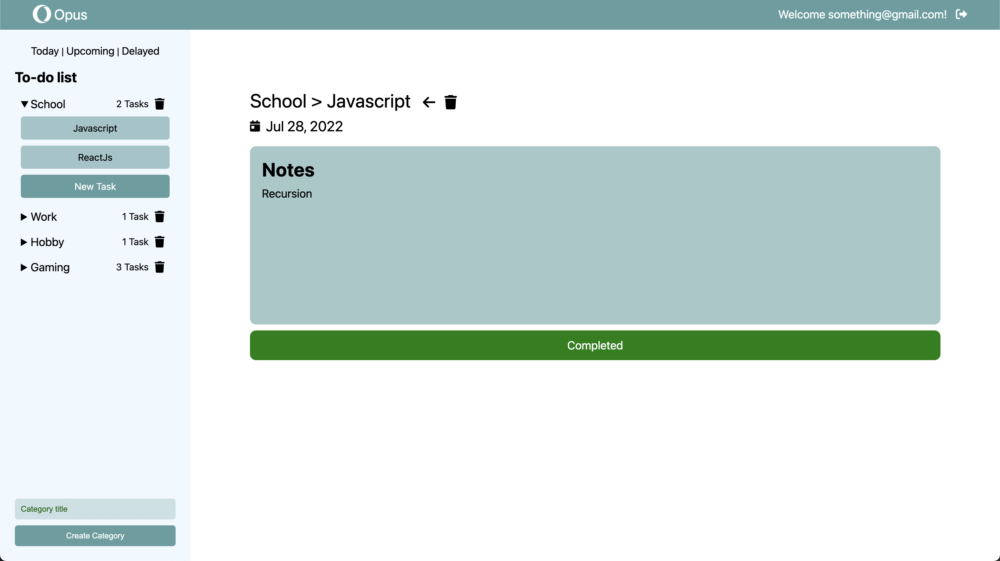
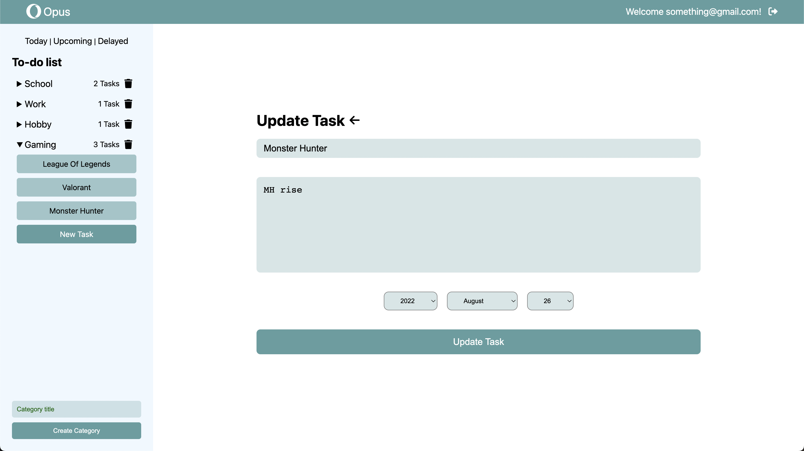

### ✨ [Journal App (Click to see live version)](https://opus-logs.herokuapp.com/   )

>> ###### *A Ruby on Rails application that allows a user to create tasks under a category.*
>> - Implemented a sidebar with links to allow users to easily navigate through tasks using the Rails Partial template.
>> - Added model validation for the uniqueness of a categoryʼs title, format, as well as the presence of task date.
>> - Prohibits access of other userʼs categories and tasks with proper Active Record associations.
>> - Utilized the Rails count method to display the quantity of tasks under a certain category.
>> - Sorted tasks in accordance to its creation using Date object methods.

>> ###### **Sign in as admin**
>> - Email address: egiatrading@gmail.com
>> - Password: 1234567890

>> ###### Sources:
>> - Heartcombo's [Devise Tutorial](https://github.com/heartcombo/devise)
>> - Ruby on Rails's [Guides](https://guides.rubyonrails.org/v6.1/)
